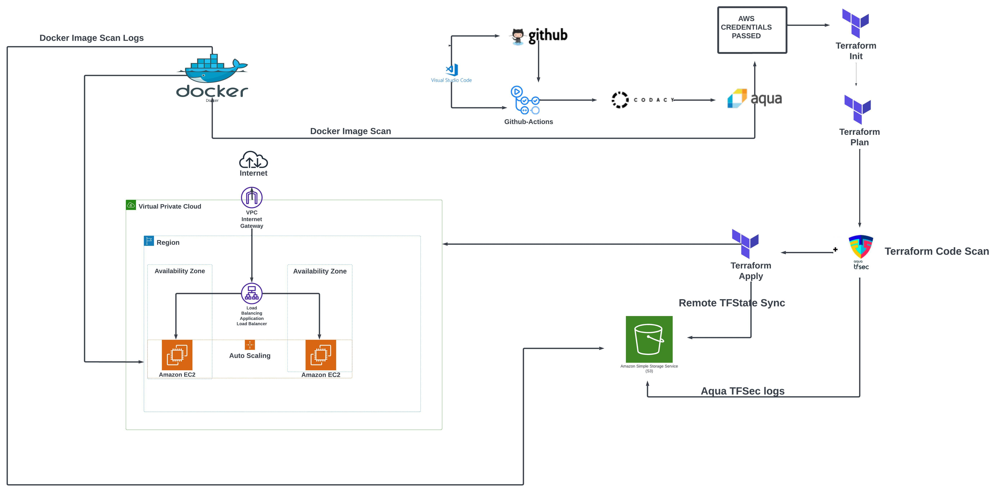

# CI/CD Pipeline with Docker, Terraform, Trivy, and tfsec

This repository contains a CI/CD pipeline setup for deploying infrastructure on AWS. It uses GitHub Actions for automation, Docker for containerization, Terraform for infrastructure as code, Trivy for vulnerability scanning, and tfsec for static code analysis.

## Workflow Overview

Below is the flow of the CI/CD pipeline as depicted in the provided flowchart:

1. **Code Commit**: Developers commit code to the repository which triggers the CI/CD pipeline.
2. **GitHub Actions**: On a push to the main branch, the defined GitHub Actions workflows initiate the CI/CD process.
3. **Terraform Workflow**:
    - **Terraform Init**: Initializes the Terraform working directory and downloads necessary providers.
    - **Terraform Plan**: Creates an execution plan, showing what actions Terraform will perform upon applying.
    - **Terraform Apply**: Applies the changes to reach the desired state of the configuration.
4. **Security Scanning**:
    - **Aqua Trivy**: Scans the Docker image for vulnerabilities and generates a report.
    - **tfsec**: Performs static analysis of the Terraform files for potential security issues.
5. **Docker**:
    - A Docker image is built from the Dockerfile and pushed to a Docker registry.
6. **AWS Integration**:
    - The infrastructure is deployed to AWS, creating resources like EC2 instances, Auto Scaling groups, and setting up a load balancer within a VPC.
7. **Artifact Storage**:
    - Security scan results from Trivy and tfsec are stored in an S3 bucket for record-keeping and further analysis.

## Detailed Workflow Steps

The `.github/workflows/main.yml` file outlines the following detailed steps:

- **Build and Push Docker Image**: A Docker image is built from the Dockerfile and pushed to the Docker registry.
- **Deploy Infrastructure with Terraform**: The pipeline deploys infrastructure to AWS using Terraform, which includes setting up EC2 instances with auto-scaling and load balancing within a VPC.
- **Pre-Deployment Security Scans**: The Docker image and the codebase are scanned for vulnerabilities using Trivy. The Terraform files are also analyzed using tfsec for any potential security issues.
- **Results and Reports**: The findings from Trivy and tfsec are uploaded to a designated AWS S3 bucket. This ensures that any vulnerabilities or issues are logged and can be reviewed.

## Usage Instructions

(Usage instructions as provided in the previous README section)

## Contributing

(Contribution guidelines as provided in the previous README section)

## Security

(Security contact as provided in the previous README section)

## License

(The licensing details as provided in the previous README section)

## Acknowledgments

(Acknowledgments as provided in the previous README section)

# HTML-WEBSITE-CICD
Designed and created a portfolio website, implemented Docker for consistent environment setup and GitHub Actions for automated CI/CD, ensuring seamless updates and functionality.

[Live website](https://moesportfolio.com/)

## Terraform

### Infrastructure as Code:

#### Setting Up AWS with Terraform

Using Terraform for setting up AWS infrastructure was both challenging and rewarding. It allowed me to define my infrastructure in code form, making it easy to track. I used Terraform scripts to create an EC2 instance, which serves as the backbone of my website hosting.

#### Features of the AWS Setup

In AWS, I meticulously configured an auto-scaling group to ensure that the website could handle varying loads by automatically adjusting resources. I also utilised two availability zones for increased reliability. The load balancer was key in managing incoming traffic efficiently, while the public subnets and an internet gateway were crucial for connecting my website to the wider internet. This robust setup provided a reliable and scalable foundation for my website.

## AWS Infrastructure Diagram

